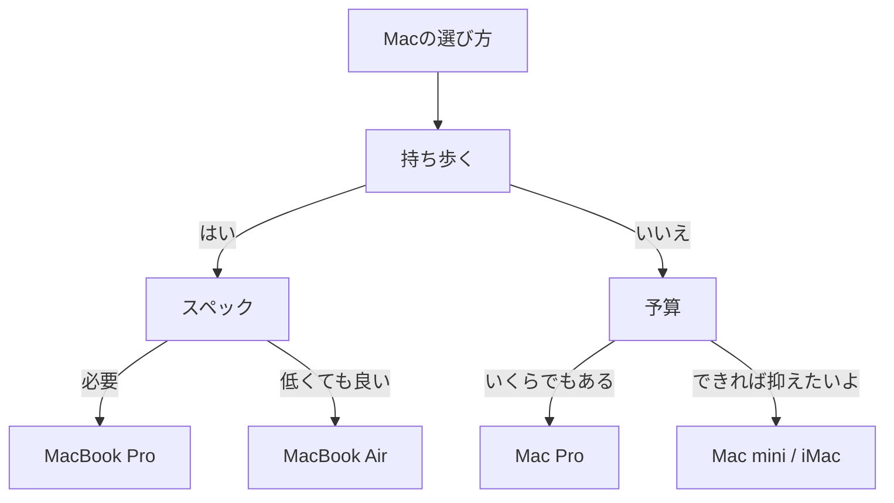
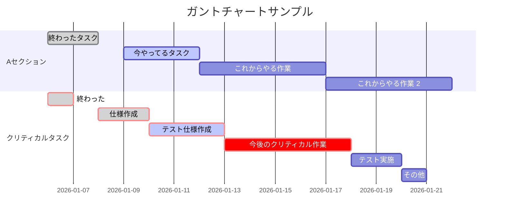

# Introduction

## 追加してみた
## 追加成功

```mermaid
graph TB
  Macの選び方 --> 持ち歩く
  持ち歩く -->|はい| スペック
  持ち歩く -->|いいえ| 予算
  スペック -->|必要| R1[MacBook Pro]
  スペック -->|低くても良い| R2[MacBook Air]
  予算 --> |いくらでもある| R3[Mac Pro]
  予算 --> |できれば抑えたいよ| R4[Mac mini / iMac]

```

```mermaid
 gantt
       dateFormat  MM/DD
       title ガントチャートサンプル
       
       section Aセクション
       終わったタスク      :done,    des1, 01/06,01/08
       今やってるタスク    :active,  des2, 01/09, 3d
       これからやる作業    :         des3, after des2, 5d
       これからやる作業 2  :         des4, after des3, 5d

       section クリティカルタスク
       終わった            :crit, done, 01/06,24h
       仕様作成            :crit, done, after des1, 2d
       テスト仕様作成       :crit, active, 3d
       今後のクリティカル作業:crit, 5d
       テスト実施          :2d
       その他             :1d
```