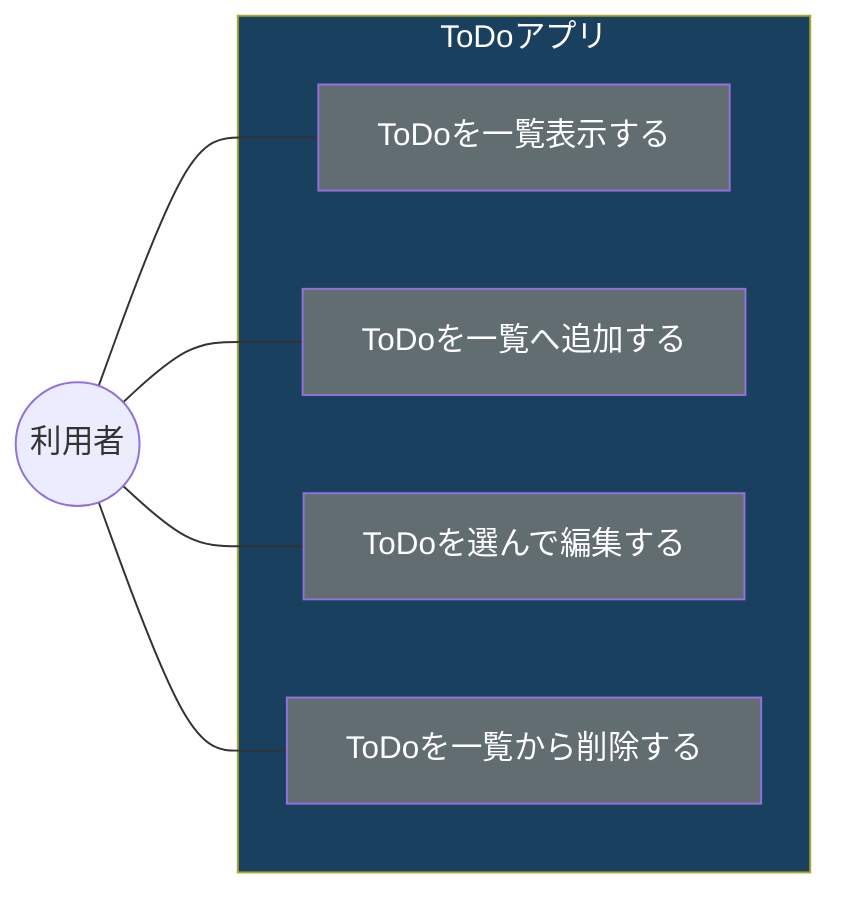

# ToDoアプリケーション 

# 概要 Todoを登録、変更、削除できるWebアプリケーション

## ユースケース

## シーケンス

## 仕様
| ボタン名           | 表示     | タイミング |
| :---------------- | :------: | --------: |
| 追加ボタン         |  True    | 23.99     |
| SQL Hat           |   True   | 23.99     |
| Codecademy Tee    |  False   | 19.99     |
| Codecademy Hoodie |  False   | 42.99     |