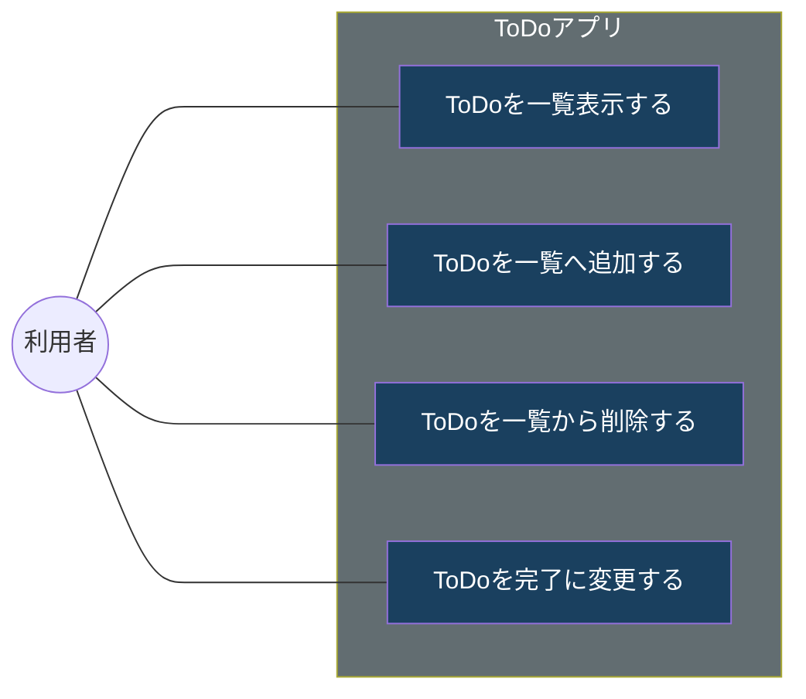
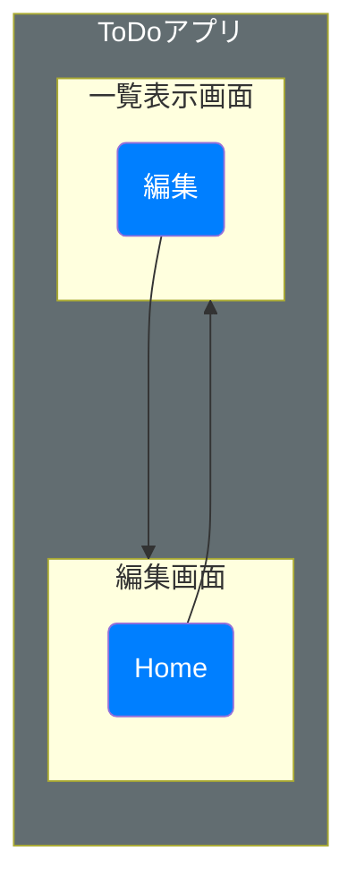

# ToDoアプリケーション 

# 概要 Todoを登録、変更、削除できるWebアプリケーション

## ユースケース

---
---

## 画面遷移

---
---

## 一覧画面ヘッダー情報
| No.  | 表示名     | タイプ     | 説明                        |
| :--- | :-------: | ---------: | :-------------------------- |
| 1    |  タイトル  | ラベル     | タイトルを表示する            |
| 2    |   Home    | ボタン     |  一覧画面を再描画する         |

## 一覧画面明細情報
| No.  | 表示名     | タイプ     | 説明                        |
| :--- | :-------: | ---------: | :-------------------------- |
| 1    |  No       | TBLラベル  | 数値を表示する                |
| 2    |   内容    | TBLラベル   | 文字列を表示する             |
| 3    |   期限    | TBLラベル   | 日付を表示する               |
| 4    |   完了    | TBLボタン   | ToDoを完了にする             |

## 一覧画面操作情報
| No.  | 表示名     | タイプ     | 説明                        |
| :--- | :-------: | ---------: | :-------------------------- |
| 1    |   編集     | ボタン     | 編集画面へ遷移する           |
| 2    |   更新    | TBLラベル   | ToDoの完了状態を更新する     |

## シーケンス