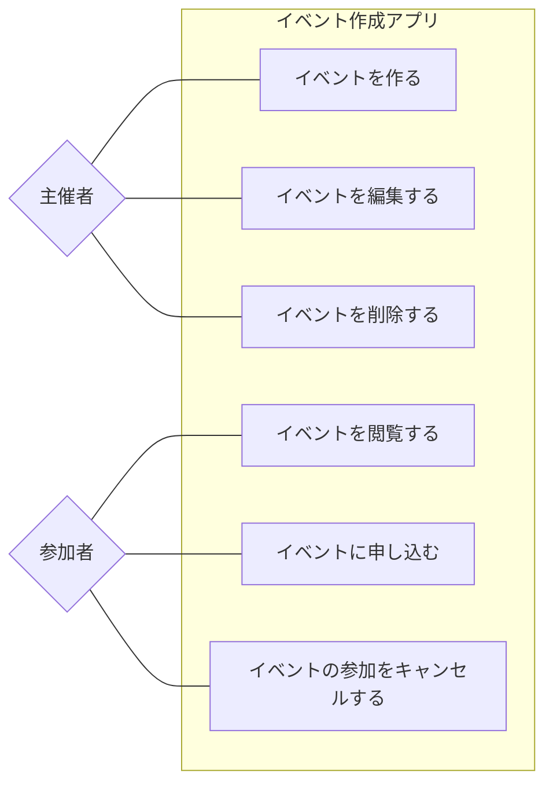

# ToDoアプリケーション 

# 概要 Todoを登録、変更、削除できるWebアプリケーション

## ユースケース

```mermaid
flowchart LR

A{主催者}
E{参加者}

A --- B[イベントを作る]
A --- C[イベントを編集する]
A --- D[イベントを削除する]
E --- F[イベントを閲覧する]
E --- G[イベントに申し込む]
E --- H[イベントの参加をキャンセルする]

subgraph イベント作成アプリ
  B
  C
  D
  F
  G
  H
end

```

## シーケンス
