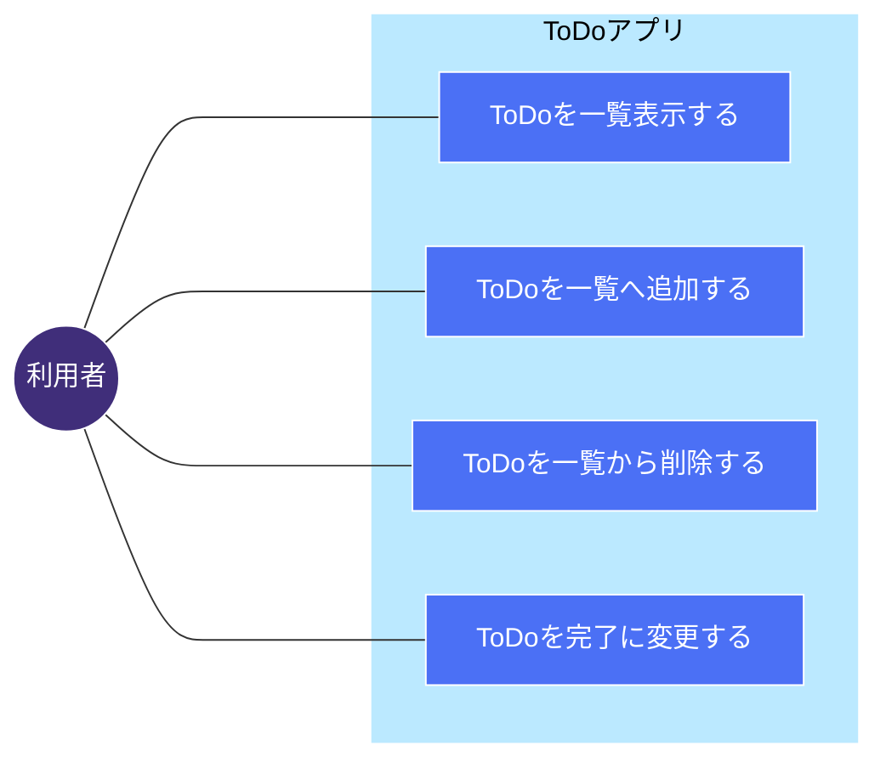
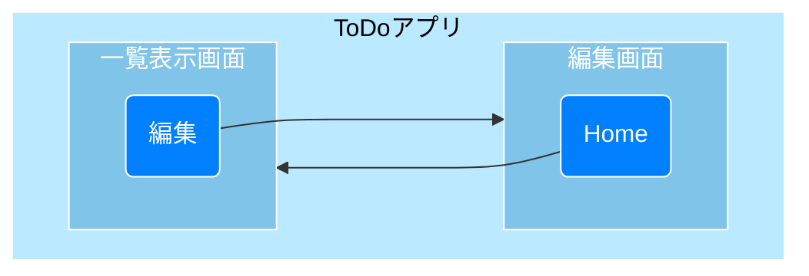

# ToDoアプリケーション 

# 概要 Todoを登録、変更、削除できるWebアプリケーション

## ユースケース

* ### ToDoを追加、変更、削除できること
* ### ToDoの登録順にNo.が採番されること
* ### ToDoの情報として、「内容」、「期限」、「完了状態」をもつこと
* ### 一度の操作で複数のToDoが登録できること
---
---

## 画面遷移

