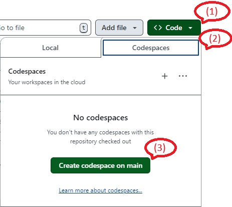

## CodeSpace開始手順

GitHubのリポジトリを選択後に以下の画像右上から  
（１）「 <> Code ▼」をClickします。   
（２）「Codespaces」をClickします。    
（３）「Create codespace on main」をClickします。  
ブラウザのタブが１つ追加されCodeSpaceが起動します。

 
 
 
 

## CodeSpaces終了手順

GitHubのリポジトリ表示を更新（ブラウザのリロードまたはF5キー押下）してください。  

開始手順の(1)と(2)と同じ操作を行います。  
  
以下の例では「laughing-space-adventure」という名前(URLで確認)で  
Codespacesが起動されている状態をあらわします。  
(この名前はCodespacesが起動されているタブのURLにて確認できます。)  
その横にある「・・・」(3点リーダー)をClickします。
  

 
 
 

Clickすると以下のメニューが表示されます。  
一番下にある「Delete」をClickします。  

 
 
 

Clickすると確認のダイアログが表示されます。  
「Delete」をClickします。  

